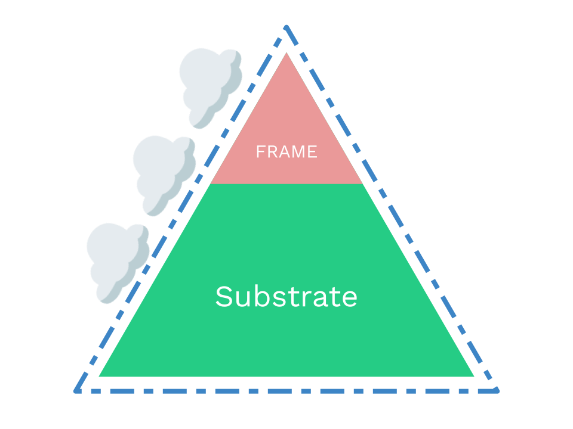
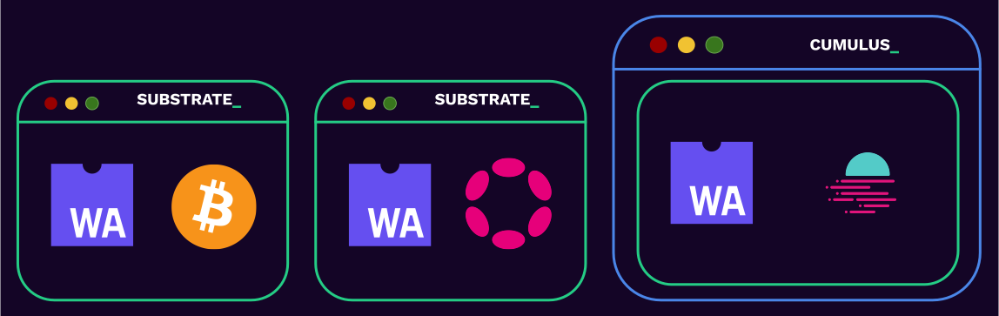

# The Polkadot SDK

---


### Why Polkadot SDK?

- Building a blockchain is really, really hard.
- Even if you are an expert coder, the chances to get something wrong is high.
- We envision in a future that needs many blockchains.
- So we need to make blockchain development easy and safe!

---

### Polkadot SDK

⛓️‍💥 Substrate 🤝 FRAME 🤝 Cumulus ⛓️‍💥



---

### Polkadot SDK

- Substrate: Un-opinionated primitives for building blockchains based on a WASM meta-protocol.
- FRAME: An opinionated way to build that WASM protocol/runtime/STF.
- Cumulus: Parachain turbocharger

Note:

**FRAME** is a subset of blockchain within Substrate that allow you to focus only on writing the
state transition function aka. Runtime of your blockchain and not deal with the rest of the
software. WASM.

---

### Polkadot SDK



All proudly™️ built with Substrate.

1. the mighty Polkadot Relay Chain
2. all the Polkadot Parachains to date.
3. (less known) can be used to build any blockchain unrelated to Polkadot.

---

### What is Substrate?

Substrate is a Rust framework for building modular and extensible blockchains.

---

### Why Rust?

Check out: https://www.parity.io/blog/why-rust

<div class="flex-container">
<div class="left">

- Rust is Safe
- Rust is Fast
- Rust is Lightweight
- Rust is Idiomatic
- Rust is Fun (?)

</div>
<div class="right">


</div>

---

### Substrate Architecture

At a very high level, a Substrate node has two parts:

1. The Client - A Wasm executor.
2. A Wasm runtime.


Notes:

About the naming of runtime: its not the traditional sense of "runtime".

---

## What is the Runtime?

The runtime contains all of the business logic for executing the **state transition function** of the blockchain.

---

### Turing-Complete State Machine

- Turing completeness basically means you can implement any computer algorithm.
- Besides limitations from execution time, memory size, or storage limitations... the runtime is a turing-complete state machine.
- The state machine itself is broken into two components:
  - The state itself
  - The state transition function

---

### State Transition Function

Things that "transition the state":

- Messages from the "outside world".
  - For example transactions from users.
- Automated on-chain logic.

Notes:

We'll be revisiting these concepts later in this module.

---

## Runtime as a VM

The Runtime is designed as a Virtual Machine within the Substrate client.

### Why?

- Runtime code must execute deterministically.
- Runtime code should be sandboxed.

<br>

### VMs enable this.

Notes:

VMs handle "undefined behavior". Once translation from source to Wasm happens, the binary code is fixed. Thus if any undefined behavior is invoked the behavior will be identical, even if wrong / unintended.

---

### The runtime is always a Wasm binary.

Notes:

This decision is extremely important for so many reasons we will touch on throughout the course.

---

## Wasm

- Wasm is short for WebAssembly
- It is a binary instruction format for a stack-based virtual machine.
- Originally built for the web as a faster and better alternative to technologies like JavaScript.
- The open standards for WebAssembly are developed by W3C groups.


---

### Why Substrate chose Wasm?

<div class="flex-container">
<div class="left">

- Compact: Designed to be easily transferred over the web.
- Sandboxable: Keeps Wasm Safe, as capabilities have to be exposed explicitly to the Wasm environment.
- Deterministic(-ish): assuming all outputs are defined given some instruction set.
- Performance: direct mapping of operations to machine code.
- Well Supported: WASM is on its way to become a core component of the web, just like JavaScript did.

</div>

<div class="right">


</div>
</div>

---

## Runtime Assumptions

To make a Substrate compatible runtime, our only assumptions are:

- It exposes a specific Runtime APIs.
- It has access to specific client-side host functions.


Notes:

We will learn more about Runtime interfaces in lesson 4.

---

### The Client

- This is simply the natively compiled binary which runs on your computer.
- It has access to do much more things then the restrictive Wasm VM environment.
- Generally, determinism is not important at this level.
  - Allows multiple implementations to be created.
  - Allows for compilation to different targets.

---

## Client Components

<div class="flex-container">
<div class="left">

- Networking
- Database
- Transaction Queue
- Consensus
- Telemetry
- Runtime
- Tools
- And more!

</div>
<div class="right">


</div>
</div>

---

### Wasm is stored on chain!


Notes:

The state transition function of the blockchain it part of it's own state!

---

### Problems with Hard Forks

Not everyone updates their client software in time.


Notes:

This leads to security problems, coordination issues, decision making issues, and much more....

---

### Upgrading the Substrate Runtime


---

### Upgrading the Substrate Runtime


---

### Upgrading the Substrate Runtime


---

### Game Console Analogy

<div class="flex-container">
<div class="left">


Substrate Client

</div>
<div class="right">


Substrate Runtime

</div>
</div>

---

### Technical Freedom vs Ease


---

## What is FRAME?

FRAME is a Rust framework for more easily building Substrate runtimes.

---

## Explaining FRAME Concisely

<pba-flex center>

- Writing a blockchain application:
  - Without FRAME: 2210 lines of code.
  - With FRAME: 310 lines of code.
    - 7x Smaller.

</pba-flex>

---

## Goals of FRAME

- Make it easy and concise for developers to do development.
- Provide maximum flexibility and compatibility for pallet developers.
- Provide maximum modularity for runtime developers.
- Be as similar to vanilla Rust as possible.

---

## Pallets

FRAME takes the opinion that the blockchain runtime should be composed of individual modules. We call these Pallets.


---

### "Shell" Pallet

```rust
#[frame_support::pallet]
pub mod pallet {
  #[pallet::pallet]
  pub struct Pallet<T>(_);

  #[pallet::config]
  pub trait Config: frame_system::Config { ... }

  #[pallet::event]
  pub enum Event { .. }

  #[pallet::error]
  pub enum Error { .. }

  #[pallet::storage]
  // snip

  #[pallet::call]
  impl Pallet { .. }
}
```

---

## Pallets Included in the Polkadot SDK

- Balances, Tokens, NFTs, Cryptocurrencies
- Decentralized Exchanges
- Governance, Voting, Collectives
- Account Abstractions (Multisig, Proxy, Batch, etc...)
- and WAY more...

---

## Think Less, Build More

With the Polkadot SDK, building a blockchain can be easy.

---

<!-- .slide: data-background-color="#4A2439" -->

# Questions
