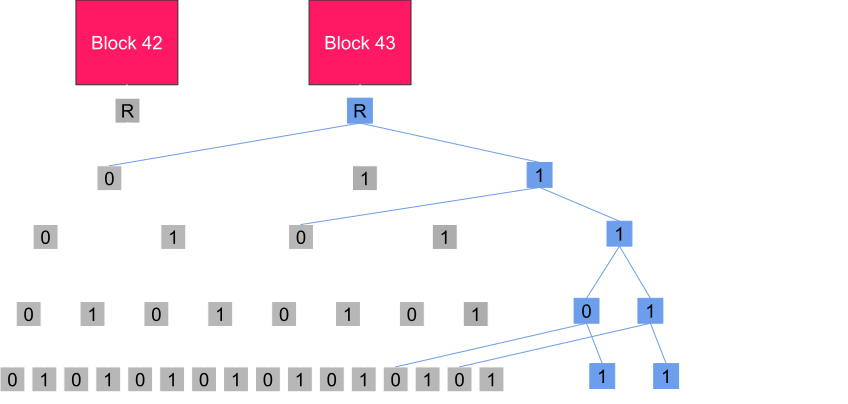
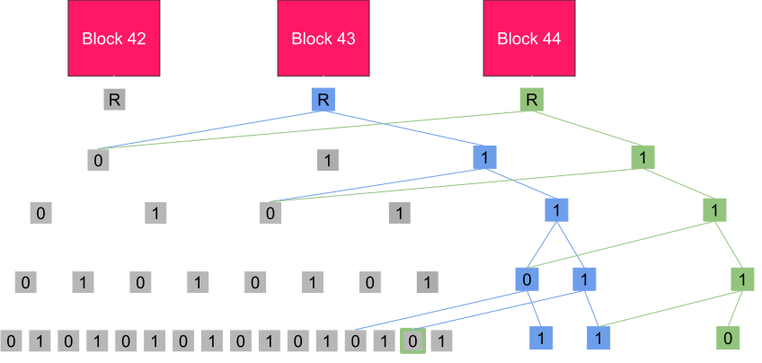
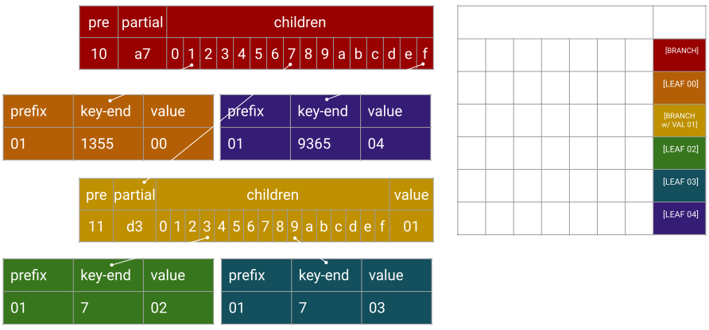
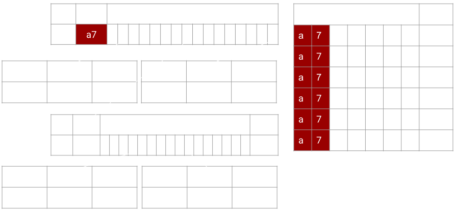
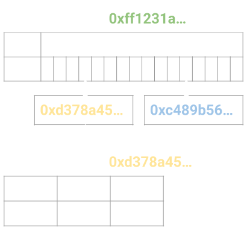

# Merklized Storage

---

### Why is this topic important?

To understand the underlying structure which allows for "verifiable proofs" in Polkadot.

Merkle Tries.

---

## Since Bitcoin...

---

### Merkle Tree

1. Collect all the data you want to place in the merkle tree structure.
1. Find the hash of each piece of data.
1. Take two hash nodes and hash them into a new hash node.
1. Repeat this process for the new nodes until there is a single hash.
1. The final hash is the merkle root hash.

---

### Merkle Proof

- Blue: Data you need in the proof.
- White: Data you calculate via hashes.
	- Not needed in the proof!
- Black: Data implied by the Blue nodes.
	- Not needed in the proof!
- Pink: Merkle root hash
	- Not needed in the proof!
	- Must be recalculated by you.
	- Must be provided by a verifiable decentralized source.
	- Must match.

---

### Patricia Trie

- Position in the tree defines the associated key.
- Space optimized for elements which share a prefix.

---

### Merkle Trie

---

### Base 16

- We will mostly show binary trees for simplicity.
- But everything scales up as you add more nodes.
- 16 is a nice choice because it is 1/2 of a byte (two hex characters)
  - one hex character is a "nibble"

---

### Merkle Trie Complexity

Reading, Writing, Proofs

---

### Merkle Read

- $O(\log{n})$ reads
- Not so great.

---

### Merkle Write

- Very expensive for a database
- $O(\log{n})$ reads, hashes and writes

1. Follow the trie path to the value: $O(\log{n})$ reads
2. Write the new value: 1 write
3. Calculate new hash: 1 hash
4. Repeat (2) + (3) up the trie path: $O(\log{n})$ times

---

### Merkle Proof

- $O(\log{n})$
- Great for light clients!
- Low bandwidth, low computation!

1. Full Node: Follow the trie path to the value: $O(\log{n})$ reads.
1. Full Node: Upload data of trie nodes read.
1. Light Client: Download trie node data.
1. Light Client: Verify by hashing: $O(\log{n})$ hashes.

Notes:

- Message is that proof is just enough trie content (can be a bag of node or some ordered node that needs to be complete with hashing as in compact proof TODO should we make a slide for compact proof and generally proof serialization?) to build a subset/subpart of the full state trie.

This incomplete trie will then be accessed and used identically as the full state trie, but if access is not part of the proof, then the action is not finishing: Proof Incomplete case.

Invalid proof are proof where the hashing don't match (can be see as multiple trie).

TODO Could have some schema with the full state, then the proof and then two query on the proof: one that access data available and one that fail because incomplete : Probably already exists in storage deep dive

---

### Compact Proof

- Simple encoding to remove redundant information
- Trie node codec already strives for compact encoding
- Still hashes info is redundant
- Nodes are ordered to reflect the trie structure

Notes:

- trie node codec strives to make things compact

So merkle hash is calculated over most compact number of bytes.

- Still hashes info is redundant.

again in a three node V1 and V2 only tree, if proof is for V1 only, then the proof contains two nodes: root (a branch) and V1 (a leaf).
Then the encoding of root will contains two hashes V1 leaf hashes and V2 leaf hashes.
Obviously V1 leaf hashes can be calculated by hashing V1 leaf, so we can just remove it from the root node and gain 32 non compressable bytes.

- Nodes are ordered to reflect the trie structure

by ordering in a given way we can deduce the child parent relationship of nodes.
This can be done in multiple way, for instance encode in the trie node iteration: root -> V1 then when decoding stack root and when unstack complete with V1 hash.
or the other way V1 -> root (here the building need to stack root), then when decoding V1 then root.
Most/all trie algo are about keeping a stack of node (when more memory is used there is something wrong (~ 1 or two nodes)).

---

### Proof Recorder

- Tool used to create proofs for transactions
- Simple footprint of all trie nodes accessed
- Then re-encoded (compact proof)

Notes:

Another message to convey is that producing proof is really only recording all access made during some actions (key access, value insert, value change, trie iteration...).
Any kind of changes work.
-> write is a bit tricky in the sense it only read access and in memory changes. eg three node trie with V1 and V2 and a parent node, inserting V3 can just be adding a sibling to V1 and V2, but V3 will not be in proof, just the parent node.

This could be extended by the idea that key value caching should be disable for the first action otherwise trie node would not be access and we would not register proof correctly.
-> can extend to Basti pr where there is two kind of cache: trie node level cache that is safe to use and key value cache that
Not sure it is worth going to far on cache strategy, but may be relevant to mention that by its structure trie node cache is shared between block.

---

### Storage and proof size.

- Base 16 trie good for disk storage and requires less hashing.
- Binary trie proof footprint is smaller and uses less bandwidth.

Notes:

The trie structure (hexary) is mostly related to the storage model and do not produce the more compact proofs. One direction would be to decorelate storage from merklization. eg hexary node in storage but merklization over binary node. But the model get more complex.

A final message to it should be that (eth see it), the storage model is still not the most efficient: we use merkle trie index to access node that are stored under a btree index (rocksdb), a true state db would have it's inner indexing directly using the merkle structure.
Paritydb in this sense in a good middle ground as it implement a hash map access directly so the merkle trie index is over a hash map rather than a btree map: that is a huge gain.

What works in memory as simple data structure, also work as a db over disk and also extend to being merklized. Usually things can be mapped or referred to rather naturally. For instance an optimization of radix trie is not storing the full merkle path in each node and get the key with the value: this work in memory (not a huge gain), this work on disk (huge gain as you can have fix len node which is big gain for disk access), can work with merkle proof (but tricky if codec still store the full partial key).

---

### Pruning

- For holding older block states, and then cleaning up.
- Let’s update two values in this trie.

---

### Pruning

- We create new database entries, but keep the old ones too!

---

### Pruning

---

### Pruning

- Eventually, we prune the old data.

---

### Real World Implementation

A merkle trie library is applied on top of a regular key/value database.

To understand how to parse the data in the database, you need to understand two different keys:

 

1. Merkle Trie Key Path
2. Key Value Database Key Hash

---

### What You Will See

---

### Navigating Substrate Storage

---

### Navigating Substrate Storage

---

### Navigating Substrate Storage

---

### Navigating Substrate Storage

---

### Navigating Substrate Storage

---

### Navigating Substrate Storage

---

### Navigating Substrate Storage

---

### What You Just Saw

 

Patricia provides the **trie path**.

 

Merkle provides the recursive **hashing** of children nodes into the parent.

---

<!-- .slide: data-background-color="#4A2439" -->

# Questions
