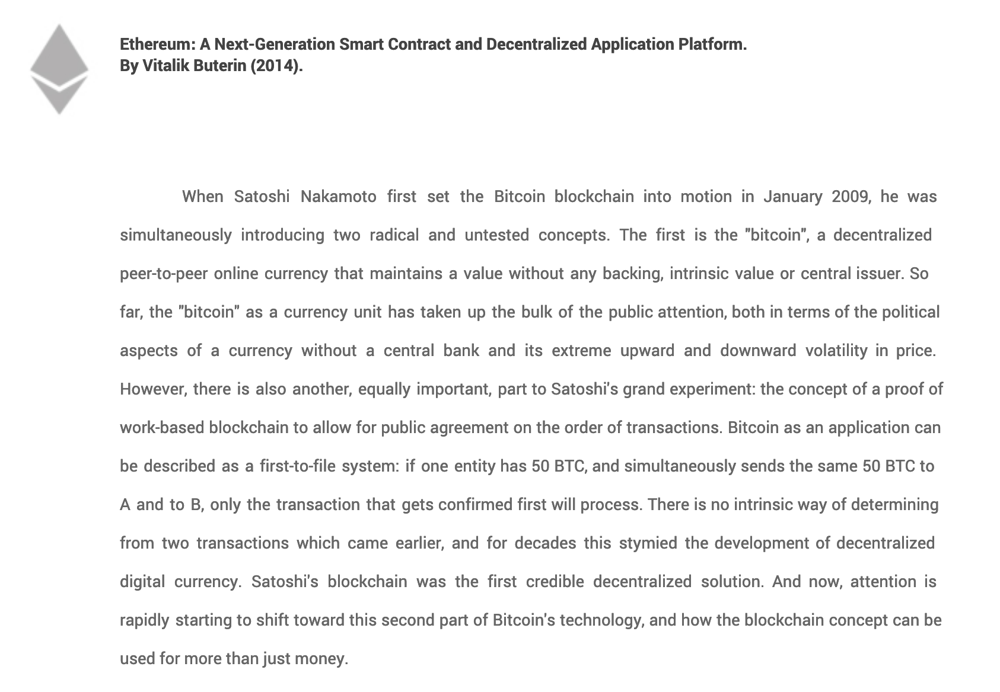
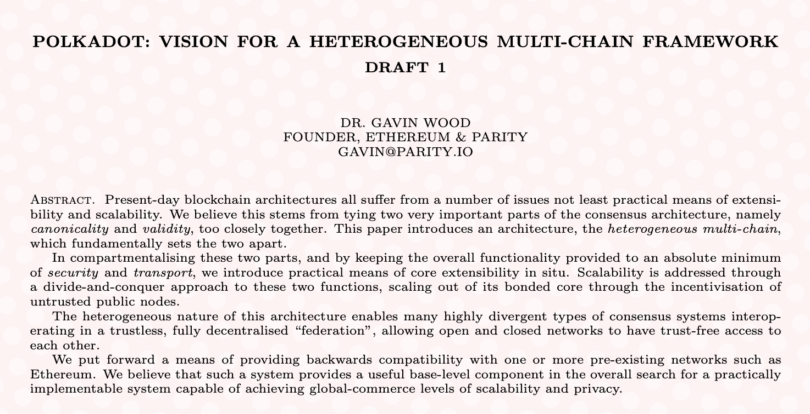
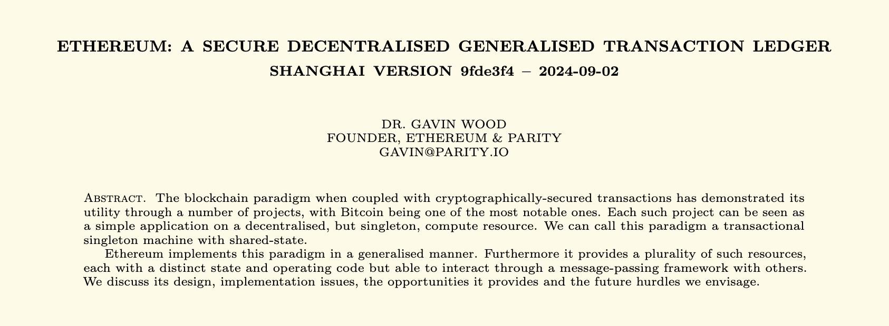
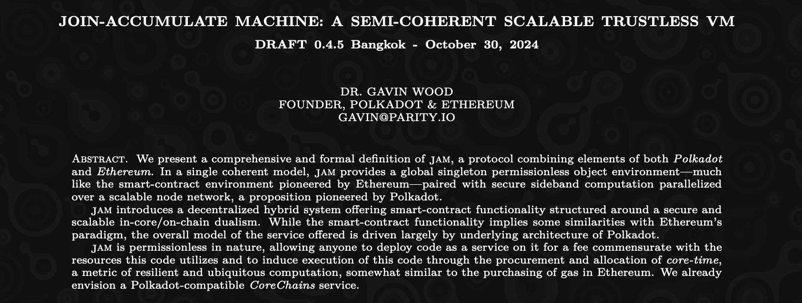
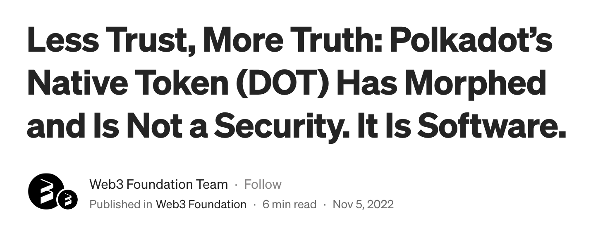

# Launching a Blockchain

---

## Disclaimer

I am not a lawyer, advisor, financial consultant, or anything like that.

These are notes on the history of how Polkadot and how many other blockchains have launched.

You really should seek professionals if you plan to do this yourself.

---

## Timeline

- White Paper
- Incorporation
- Initial Coin Offering
- Network Launch
- Decentralization

---

# White Paper

The white paper is the blueprint of the blockchain.

It should cover all the goals of the project:

1. Philosophical
2. Technical
3. Economic

---

## Bitcoin White Paper

"Bitcoin: A Peer-to-Peer Electronic Cash System"

https://bitcoin.org/bitcoin.pdf

---

## Ethereum White Paper

"Ethereum: A Next-Generation Smart Contract and Decentralized Application Platform"

https://ethereum.org/content/whitepaper/whitepaper-pdf/Ethereum_Whitepaper_-_Buterin_2014.pdf

---

## Polkadot White Paper

"POLKADOT: VISION FOR A HETEROGENEOUS MULTI-CHAIN FRAMEWORK"

https://github.com/polkadot-io/polkadot-white-paper

---

## Key Sections

- **Problem Statement**
    - Define the issue your blockchain intends to solve.
- **Proposed Solution**
    - Outline how blockchain technology will addresses the problem.
- **Technical Architecture**
    - High-level overview of the blockchain protocol.
    - Describe core technology, consensus mechanism, and differentiators.
        - Not a technical specification!
- **Tokenomics**
    - Economic model for token supply, distribution, and utility.

---

## Example: Polkadot

- **Problem Statement**

    The Blockchain ecosystem suffers from the ability to Polkadot aims to solve the issue of blockchain scalability and interoperability by enabling multiple blockchains to natively share security and information.

- **Proposed Solution**

    Polkadot’s multi-chain framework allows different blockchains to share economic security and interoperate with one another.

---

## Example: Polkadot (cont.)

- **Technical Architecture**

    - Polkadot allows multiple blockchains to execute in parallel.
        - Heterogenous sharding
    - Polkadot pools and shares security among a validator set using nominated proof-of-stake (NPoS).
    - Polkadot maintains open messaging channels between blockchains.

- **Tokenomics**

    - DOT's primary utility is purchasing blockspace.
    - DOT is also used in governance, treasury, and staking.
    - DOT has fixed inflation to pay validators and grow the treasury.

---

## Technical Specification

The Whitepaper is not a technical specification.

- Sets the tone for the project’s mission and objectives.
- Attracts potential investors, developers, and community members.
- Should be approachable for (almost) anyone to read.

To describe exactly how the project will be built, you have a separate technical specification.

---

## The Ethereum Yellow Paper

https://ethereum.github.io/yellowpaper/paper.pdf

---

## The Polkadot Gray Paper

https://ethereum.github.io/yellowpaper/paper.pdf

---

## Importance of Technical Specification

- Peer Review
- Multiple Client Implementations

---

## Importance of Multiple Client Implementations

- Network Resilience
    - Reduces dependency on a single software implementation, minimizing the risk of network-wide failures if one client has a bug or vulnerability.
    - Security through Diversity

- Decentralization
    - Allows developers who are experts in different languages to still be a part of the core development of a protocol.
    - Encourages diversity in development teams and approaches, enhancing the overall decentralization of the ecosystem.
    - Encourages the spread of technical knowledge.

---

# Incorporation

To begin building your business, you need to establish different organizations.

Usually you have a separate Foundation and an Engineering Organization.

---

## Examples

- Polkadot
    - Web3 Foundation
    - Parity Technologies
- Cardano
    - Cardano Foundation
    - IOHK
- Solana
    - Solana Foundation
    - Solana Labs
- etc...

---

## Purpose of the Foundation

- Governance and Oversight
    - Establishes a structured governance model to oversee the blockchain project and its community.
- Token Distribution
    - Responsible for the fair and compliant distribution of tokens, which can be considered financial securities.
- Legal Protection
    - Minimizes legal and financial risks associated with the project by creating a buffer between the project's governance and its engineering teams.
- Community Engagement
    - Facilitates outreach, education, and community involvement, fostering a vibrant ecosystem around the project.

---

## Why Switzerland?

Most foundations are established in Switzerland.

- Regulatory Clarity
    - Switzerland offers a favorable legal framework for blockchain projects, promoting innovation while ensuring compliance.
- Crypto-Friendly Banks
    - Known for its strong financial services sector and stable economy, which can enhance trust and credibility.
- Blockchain Hotspot
    - Accessibility for international stakeholders and collaboration with various blockchain initiatives.
    - [[LINK] Zug: Where Ethereum Was Born and Crypto Goes to Grow Up](https://www.coindesk.com/consensus-magazine/2023/06/27/zug-where-ethereum-was-born-and-crypto-goes-to-grow-up/)

---

## Engineering Organization

- Build a company focused on development.
    - Easier to hire and build out a proper company.
- Mitigating Financial and Legal Risk
    - Reduces exposure to the financial and legal implications of token distribution.
    - Protects engineering teams from potential regulatory scrutiny.

---

# Initial Coin Offering

Now that you have established a Foundation that can sell a token, your project can raise money.

---

## What is an ICO?

An Initial Coin Offering (ICO) is a fundraising mechanism in which new tokens are sold to investors to raise capital for a project.

---

## Foundation's Role

- Responsible for the creation and distribution of tokens.
- Ensures compliance with national / international regulations.
- Manages investor relations.

---

## U.S. Securities Law

A security is a financial instrument that represents an investment in a common enterprise, where the investor expects to earn profit primarily from the efforts of others.

- Protects Investors: Ensures fair practices and transparency in financial markets.
- Maintains Market Integrity: Promotes trust and stability in the U.S. financial system.

Examples: Stocks, Bonds, Mutual Funds, Exchange-Traded Funds (ETFs), Options/Derivatives

---

## Securities Must be Registered

Before a security can be sold to the public in the U.S., they must be registered with the SEC.

However, there are exceptions to this rule for certain people, like accredited investors.

Consequences of Not Registering:

- Fines and Penalties: The SEC can impose substantial financial penalties for non-compliance.
- Legal Action: Issuers may face lawsuits, including forced refunds (rescission) to investors.
- Project Damage: Non-compliance damages reputation, leads to loss of investor trust, and can hinder future fundraising.

---

## The Howey Test

The Howey test can be used to determine if an asset is a security:

- **Investment of Money**: The investor commits money or other assets to the enterprise.
- **Common Enterprise**: The investment is pooled with others, meaning the investors’ fortunes are tied to the success of a single enterprise.
- **Expectation of Profit**: The investor anticipates a return on investment, often from an increase in value or dividends.
- **Efforts of Others**: The expected profits depend primarily on the work, decisions, and expertise of a third party, such as the project team or company.

If it meets all of these criteria, it is likely considered a security.

---

## ICOs are Almost Always a Security

When you launch an ICO, you are selling a security.

- **Investment of Money**: People buy tokens in an ICO.
- **Expectation of Profit**: ICO Tokens are bought because people think the price will go up.
- **Common Enterprise**: ICOs are launched by a centralized foundation.
- **Efforts of Others**: The project is built by the engineering team.

---

## SEC Framework for "Morphing"

> The [SEC's] Framework’s factors suggested that nearly every digital asset offered and sold for fundraising purposes, initially, was highly likely to constitute a security in the hands of initial purchasers. Yet the Framework also contained factors that indicated the existence of a compliant path forward — one that would permit a digital asset initially offered and sold as a security to be re-evaluated at a later date. A path that, under certain circumstances, would allow a digital asset, for purposes of U.S. federal securities laws, to no longer be a security. In other words, to morph.

---

## DOT is No Longer a Security

https://medium.com/web3foundation/less-trust-more-truth-polkadots-native-token-dot-has-morphed-and-is-not-a-security-b2a8847a70cc

---

## SAFT

A Simple Agreement for Future Tokens (SAFT) is a legal agreement where investors provide funding in exchange for tokens to be delivered at a later date once the network is operational.

- Allows projects to raise funds early with a promise of tokens, often complying with securities regulations by delaying token distribution.
- Early-stage funding from accredited investors; often used to ensure regulatory compliance in the U.S.

---

## Airdrop

An Airdrop is when tokens are distributed for free to users, typically as a promotional tool to increase awareness and incentivize network adoption.

Usually teams will allocate a portion of tokens for development.

- Avoids any sales.
- Generates a large initial user base, creating demand and liquidity.
- Decentralized distribution, community-building, and rewarding early adopters or existing token holders.

---

## Vesting Schedule

A vesting schedule is a timeline that determines when and how tokens are distributed to holders, particularly to team members, advisors, and early investors.

- Align Interests: Ensures that key stakeholders remain committed to the project's long-term success.
- Reduce Market Impact: Prevents sudden flooding of the market with tokens, which can lead to price volatility.
- Build Trust: Enhances investor confidence by demonstrating a commitment to the project and its sustainability.

---

## Managing Relationships Until Launch

Development of blockchains can be years, so it is important to keep your project relevant.

Probably do the obvious, but there is no single formula for this:

- Provide Regular Updates
- Build Community of Users and Developers
- Provide Transparency
- Business and Partner Development
- Incentive Programs

---

## Build Your Project

Good luck!

---

# Network Launch

Launching a network safely should happen in multiple phases:

- Test Network
- Canary Network
- Production Network

---

## Test Network

A Test Network (Testnet) is a private blockchain environment, launched by the development team, designed for sanity testing the network.

Usually the testnet is:

- Totally Centralized
- No Token Value
- Simulated Traffic
- Integration Tests

---

## Canary Network

A Canary Network is a fully functional and production grade blockchain with economic value and its own governance.

- Gets upgrades before the production network, meaning that bugs will be caught there first.
- Since it could go down, usually services are offered at a discount compared to a production network.
- Allow teams a space to launch their own canary version of applications at low cost.

---

## Production Network

This is the final version of your chain.

Your goal is to have zero downtime, bugs, or other issues on your Production Network.

- Test, Canary, and Production Network should stay online forever.
- Changes should always go to networks in order, with enough time to feel confident about the changes.
- You should ensure that conditions on all network are similar, else it can be hard to verify things are okay.

---

## Example: Polkadot

- Test Network: Rococo
- Canary Network: Kusama
- Production Network: Polkadot

---

# Decentralization

The final step of launching a blockchain is to actually make the network decentralized.

---

## Decentralization is a Spectrum

- We noted earlier that the initial whitepaper, token sale, and network launch is usually a centralized effort.
- The goal of a network, after launch, is to become more decentralized.
- Eventually, if a network is decentralized enough, we could show that the product is not owned by a "Common Enterprise".
- Thus "morphing" it from a security to a non-security.
- There is no specific rule which defines when this happens. It is up to the judgement of others.

---

## Decentralization is Not the Goal

- Decentralization is an important part of Blockchains, but often confused as the goal for many systems.
- The goal of blockchain systems is **resilience**.
    - Decentralization is one method to achieve resilience, but not the only one.
    - Other factors include: technology, cryptography, openness, diversification, etc...
- A more decentralized system is not strictly better than a less decentralized system.
- A more resilient system is strictly better than a less resilient system.

---

## On-Chain Governance

On-chain governance refers to a system where decisions about the protocol, features, and upgrades of a blockchain network are made directly on the blockchain itself.

---

## Governance Evolution

Governance control can evolve over time, becoming more decentralized:

- Root Control - Control by a single account.
- Council Control - Control by a group of elected users.
- Network Control - Control directly by the token holders.

---

## The Final Step

Continue building.

---

## The Polkadot Advantage

- Battle Tested SDK
- Open Source Libraries, Modules, Plugins
- Test, Canary, and Production Networks Available
- Decentralized Governance Modules
- Large Ecosystem of Developers for Your Team

---

<!-- .slide: data-background-color="#4A2439" -->

# Questions
