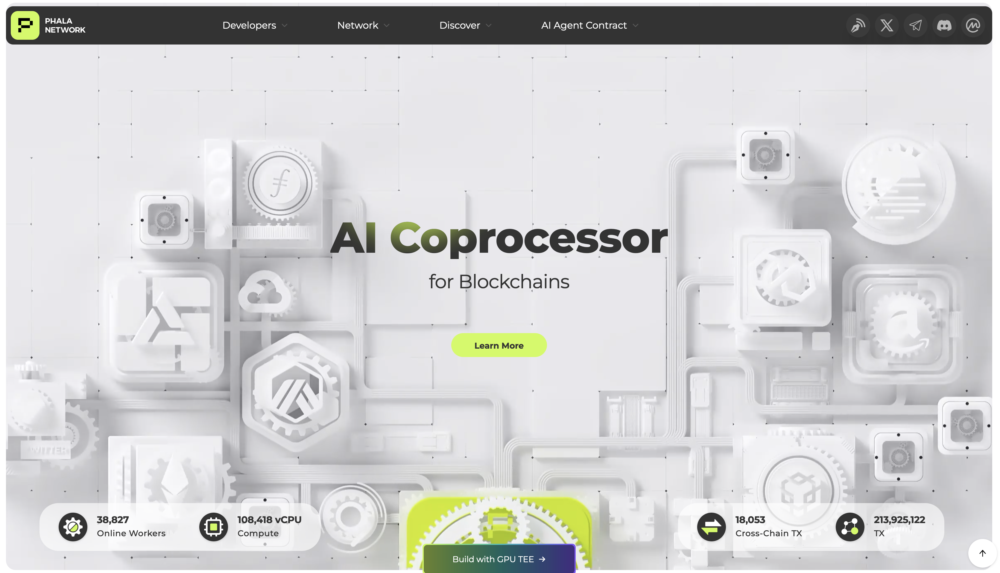
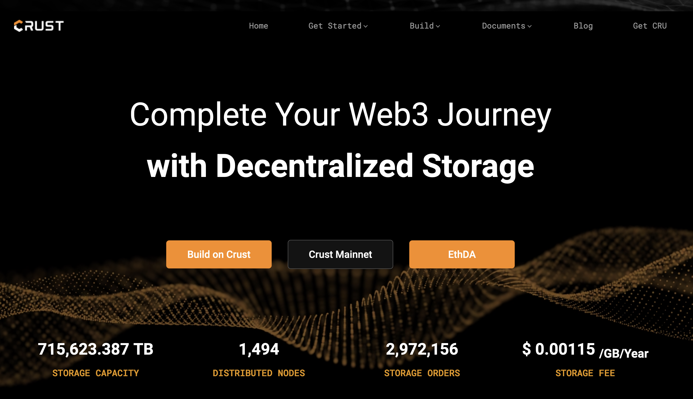

# The Future of Polkadot

---

## Decentralization Has Its Costs

Polkadot

---

## A Guiding Light

If we consider the thousands of decentralized actors

---

## The Vision of Polkadot

Polkadot is a vision toward a world with less trust and more truth.

---

## Principles of Web3

### Pillars of Blockchain

by Andreas Antonopoulos

- Open
- Public
- Borderless
- Neutral
- Censorship Resistant

### Web3 Maxims

by Gavin Wood

- Resilience
- Generality
- Performance
- Coherency
- Accessibility

---

## The Mission of Polkadot

Polkadot’s mission is to provide a scalable, secure, and resilient platform for Web3 applications and services.

---

## Technology Is the First Primitive

We acknowledge achieving this vision requires more than just technology, we think it is the first primitive the world needs to get started.

---

## The Goal of Polkadot

The current goal of Polkadot is to translate Web3 technologies into products that can be understood and used by the world.

---

## KPIs

- Mindshare / Awareness - a measure of our ability to present a compelling vision / mission / product.
- Builders (Our users) - a measure of how our products are bringing value to application builders.
- End-Users (Their users) - a measure of how applications on our platform are actually making an impact to the world.
- DOT price - a measure of the speculation on our platform’s future value to the world.

---

## The Products of Polkadot

- The Polkadot Cloud
- The Polkadot Hub

---

## The Polkadot Cloud

The Polkadot Cloud is a secure, scalable, and resilient platform for Web3 applications and services.

---

## Polkadot Cloud Services

The Polkadot Cloud offers a number of different Web3 Services such as:

- Cloud Execution Service
- Settlement / Finality Service
- Data Availability Service
- Object Storage Service
- Polkadot Rollup Service
- and more!

---

## Comparison to Web2 Clouds (1)

- Amazon EC2
	- EC2 = Elastic Compute Cloud
	- “Amazon EC2 is AWS’s service that provides secure, scalable computing capacity in the cloud.”
	- “Reliable and scalable infrastructure on-demand, with 99.99% availability SLA”
	- “purchase model to help you best match the needs of your workload”

---

## Comparison to Web2 Clouds (2)

- Amazon S3
	- S3 = Simple Storage Service
	- “Amazon S3 is an object storage service offering industry-leading scalability, data availability, security, and performance.”
	- Benefits:
		- Scalability
		- Durability and availability
		- Security and data protection
		- Lowest price and highest performance

---

## Comparison to Web2 Clouds (3)

- AWS Lambda
	- “Run code without thinking about servers or clusters”
	- “AWS Lambda is a serverless computing service that runs your code in response to events without requiring provisioning or management of servers. It automatically scales compute resources and you pay only for the compute time used. The main benefits are no server management, automatic scaling, pay-per-use billing, and performance optimization options.”

---

## History of the Polkadot Cloud

- Polkadot Cloud - Genesis: May 2020
- Polkadot Cloud - Milestone I (Parachains): November 2021
	- First Cloud Services Deploy: December 2021
- Polkadot Cloud - Milestone II (Elastic): October 2024
- Polkadot Cloud - Milestone III (JAM): TBD

---

## What is JAM?

JAM is the next evolution of the Polkadot Cloud.

JAM extends the abilities of the Polkadot Cloud, providing a more flexible foundation on which to build Web3 Applications.

---

## JAM in One Sentence

JAM takes the Polkadot Cloud from a platform for other blockchains, to a platform for any kind of Web3 application or service.

---

## The Decisions of JAM

**Unchanged**

- The Philosophies of Polkadot
- The Goals of Polkadot
  - Parallel Execution and Heterogenous Sharding
  - Shared Security
  - Interoperability

**Changed**

- Upgradability of the Core Protocol
  - Substrate -> JAM Chain
- Services (as a superset of Parachains)
- Wasm -> PolkaVM (RISC-V)
- Synchronous Communication Capabilities

---

## Is JAM a new protocol?

- JAM is a breaking change to the Polkadot Cloud architecture.
- But the vision and mission of Polkadot is unchanged.
- And almost all of the same technology is being used.

---

## 10 Year Vision

The Polkadot Cloud is bigger than "blockchain".

Blockchain is a fundamental part of architecting Web3 applications and services, but future Web3 services provided by the Polkadot Cloud should include:

- Mix Nets (ex: [Nym](https://nymtech.net/))
- Privacy Layers (ex: [ZCash](https://z.cash/))
- Oracle Services (ex: [Chainlink](https://chain.link/))
- P2P Communication Services (ex: [Whisper](https://github.com/ethereum/whisper))
- Persistent File Storage Services (ex: [IPFS](https://ipfs.tech/))

---

## 3rd Party Cloud Services

Cloud Services are not only provided directly by the Polkadot Cloud, but are also re-packaged by 3rd party services.

---

## NeuroWeb

https://neuroweb.ai/

---

## Frequency

https://www.frequency.xyz/

---

## Phala

https://phala.network/

---

## Litentry

https://www.litentry.com/

---

## Crust

https://crust.network/

---

## 3rd Party Applications

Some applications directly use the services available on the Polkadot Cloud to build Web3 Applications.

---

## Mythical Games

https://mythicalgames.com/

---

## Hydration

https://hydration.net/

---

## Zeitgeist

https://zeitgeist.pm/

---

## Apillon

https://apillon.io/

---

## The Polkadot Hub

Polkadot is currently working on a new Layer 1 blockchain that supports smart contracts and is deployed on and secured by the Polkadot Cloud.

---

## Polkadot Native Features

The Polkadot Hub has native features such as:

- Smart Contracts
- Staking
- Governance
- Treasury
- Stablecoins
- Token Registry
- etc…

---

## Smart Contracts

The Polkadot Hub uses a Ethereum-compatible smart contract platform.

This allows anyone to add their own programmable layers to Polkadot.

---

## A Place for Community

The purpose of the Polkadot Hub is to bring coordination, funding, and direction for the development and future of the Polkadot Cloud.

---

## 10 Year Vision

If we are building a community centered product, it is easy to see how it could manifest similar to Web2 social networks.

Why not when you open up the “Polkadot Hub”, it could land you on a page similar to Facebook?

---

## Polkadot Hub: Activity Feed

Imagine seeing an activity feed of everything going on in the Polkadot Hub and broader Polkadot Ecosystem:

- What proposals are currently being discussed.
- Latest announcements / features.
- Technical discussions / RFCs.
- Collectives reporting their activity.
- Ambassadors providing proof of their work.
- Memes and marketing.
- Education and tutorials.
- etc…

---

## Polkadot Hub: Navigation Menu

Now imagine in your head the left sidebar:

- Groups: The various DAOs / chat groups you are a part of.
- Events: The next in-person or online meetups for the Polkadot ecosystem.
- Marketplace: A place to use cryptocurrency trade for digital or real-world goods!
- Finance: A home for all things DeFi.
- Apps: Gateways to other applications and services hosted on the Polkadot Cloud.
- Games: A portal into Web3 enabled games and communities.

---

## Polkadot Hub: Profile

Imagine in the top right, clicking your avatar, and managing your settings and profile:

- The accounts, wallets, and balances you have control of.
- Various account abstraction settings, like multisigs and proxies.
- Contracts you have deployed and their activity (users, revenue)
- Posts you have made in the Hub, and revenue generated from engagements.
- Your public identity.
- Your private individuality proofs.
- etc…

---

## A Future with Less Trust and More Truth

We can literally rebuild the systems which spy on and extract profits from us, with trust free alternatives!

---

<!-- .slide: data-background-color="#4A2439" -->

# Questions

Does this future resonate with you?
