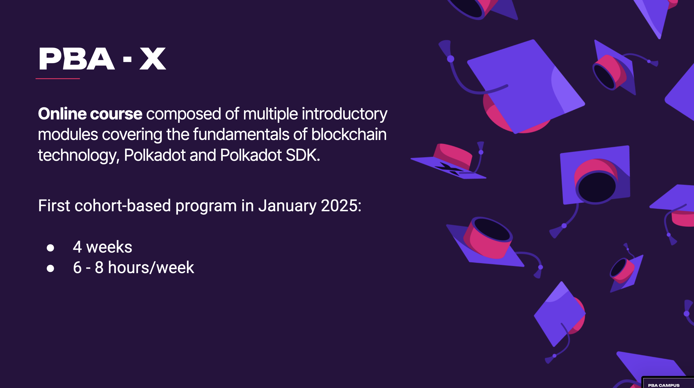
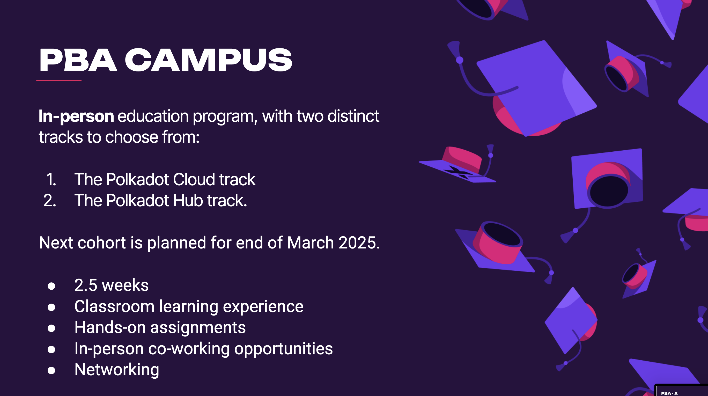
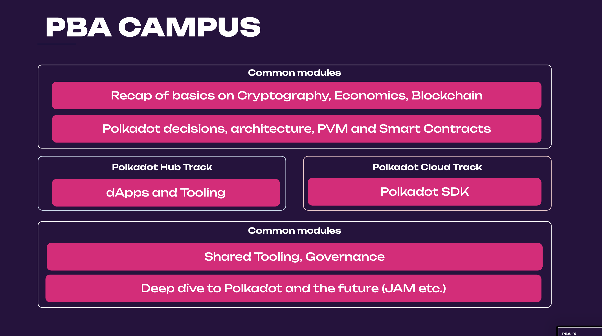
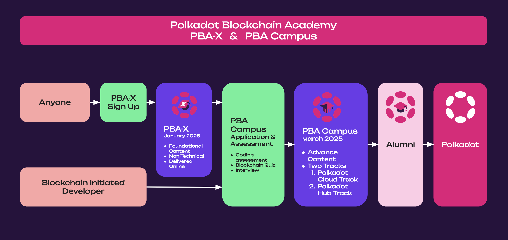

# The Polkadot Blockchain Academy

---

## PBA So Far...

---

## PBA Accessibility

In-person education is extremely powerful, but also limiting in impact and accessibility.

So the PBA is looking to split their education program into 2 parts:

1. Online
2. In-Person

---

## Introducing the PBA-X

---

## Rebuilding the PBA Campus

---

## Rebuilding the PBA Campus (cont.)

---

## PBA Student Flow

---

## PBA Content

https://polkadot-blockchain-academy.github.io/pba-content/

---

## Follow for Updates

- https://twitter.com/academypolkadot
- https://polkadot.com/blockchain-academy
